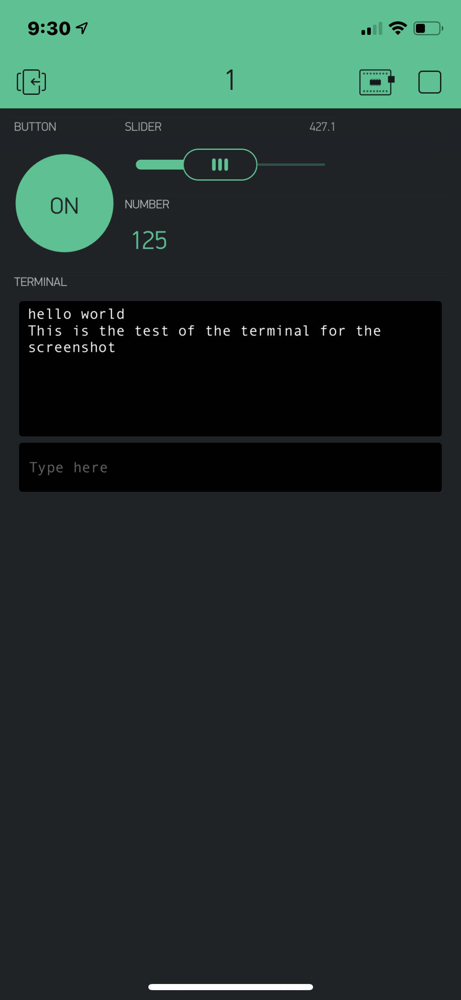

Name: Noah Zamarripa

EID: naz296

Team Number: 11

## Questions

1. What is the purpose of an IP address?

    An IP (Internet Protocol) address is a 32-bit number that is used to identify objects uniquely as they connect to the internet. There are both private and public IPs for the internet to access a larger number of devices. 

2. What is a DNS? What are the benefits of using domain names instead of IP addresses?

    DNS (Domain Name Service) is a server that translates known domains such as www.google.com to IP addresses that the computer can understand and vise versa. This is better to use so that humans don't have to remember complicated IP addresses to get to their favorite websites.

3. What is the difference between a static IP and a dynamic IP?

    A static IP does not change and is used for software that is required to remember a certain computer. Dynamic IP changes, being assigned by the network the device is connected to. Most devices use dynamic IP addresses.

4. What is the tradeoff between UDP and TCP protocols?

    You can use UCP for applications that require speed and do not require reliability such as video streaming while TCP, on the other hand, is more reliable and can be used in applications where timing is less of a concern and reliability is of most importance such as email. 

5. Why can't we use the delay function with Blynk?

    This is because the ESP32 has hardware built in it that allows automatic output PWM signals on every pin, meaning delay is not necessary. 

6. What does it mean for a function to be "Blocking"?

    It means that while the function is running, nothing else can run, meaning time is wasted.

7. Why are interrupts useful for writing Non-Blocking code?

    Using interrupts in a Non-Blocking code is useful because it means that the code can always be interrupted to run a higher priority function, no matter where it is.

8. What is the difference between interface and implementation? Why is it important?

   An interface defines and outlines what a function can do, but does not actually do it. Implementation carries out the function declared in the interface. This is important because having an interface allows you to later use a better implementation and keep the method the same. They are also extremely important in creating an abstraction of functions.

9. Screenshot of your Blynk App:

    
